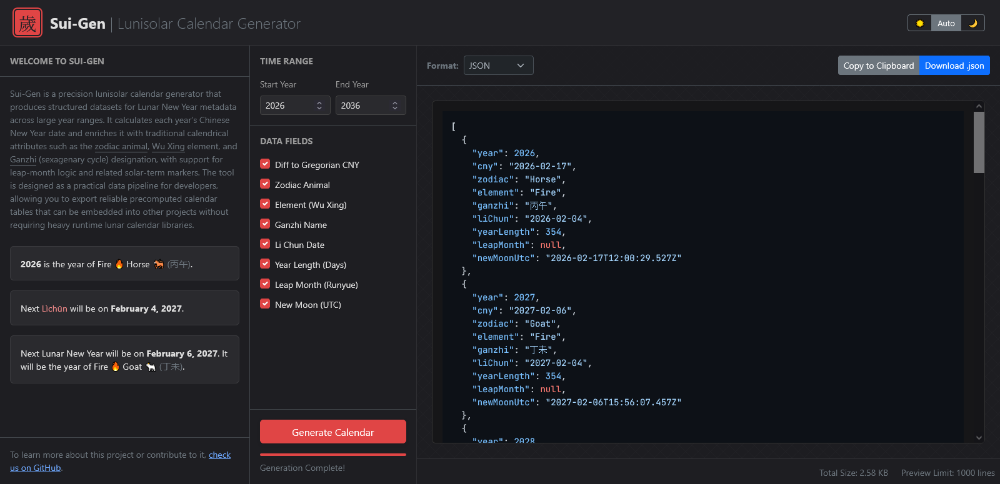

# Sui-Gen (歲-Gen)

**Sui-Gen** is a precision lunisolar calendar generator designed for accuracy and ease of use. It allows developers, researchers, and enthusiasts to generate structured datasets of Lunar New Year metadata across centuries without relying on heavy runtime libraries.

Simply select a year range, choose your output format, and export a reliable, precomputed calendar table ready for integration into your applications.

## Key Features & Technical Details

Sui-Gen goes beyond simple date conversion. It computes a rich set of traditional calendrical attributes for each lunar year found within the specified Gregorian range:

*   **Precise Chinese New Year (CNY) Dates**: Calculates the exact Gregorian date for the first day of the first lunar month.
*   **Zodiac Animals (Sheng Xiao)**: Traditional animal sign for the year (e.g., Dragon, Snake).
*   **Wu Xing Elements**: The elemental association (Metal, Wood, Water, Fire, Earth) derived from the Heavenly Stem.
*   **Ganzhi (Stem-Branch) Cycle**: The sexagenary cycle designation (e.g., 甲辰).
*   **Leap Month Logic**: Identifies if a year contains a leap month (Runyue) and returns its index, or `null` if none exists.
*   **Solar Terms (Jie Qi)**: Specifically calculates the **Lìchūn (Start of Spring)** date, checking Solar Feb 3–5 to ensure accuracy even when it falls before the Lunar New Year.
*   **Astronomical Accuracy**: Uses high-precision algorithms for the **New Moon (Shuo)** timestamp, provided in UTC ISO-8601 format.

### Accuracy & Reliability
Sui-Gen is built upon the robust [lunar-javascript](https://github.com/6tail/lunar-javascript) library and enhanced with custom reliability gating for extreme timeframes.

#### Supported Range: CE 619 to CE 30,000+
We have implemented specialized logic to handle long-term date generation, categorization fields into three reliability tiers:

| Field Type | Reliability | Valid Range | Notes |
| :--- | :--- | :--- | :--- |
| **Cycle Fields** | **100% Reliable** | **Infinite** | Fields like *Zodiac*, *Elements*, and *Ganzhi* are calculated via pure arithmetic and remain scientifically accurate for any year, past or future. |
| **Calendar Dates** | **High Precision** | **CE 619 – 3000** | *CNY* and *Li Chun* dates match historical records and standard astronomical models. |
| **Precise Times** | **Approximate** | **CE 2050 – 2300** | Due to ΔT (Earth's rotational braking), precise times like *New Moon UTC* become approximate after 2050 (± minutes) and represent a "best guess" extrapolation. |

> **Scientific Basis**: Our ΔT extrapolations align with the models proposed by [Morrison & Stephenson (2004)](https://adsabs.harvard.edu/full/2004JHA....35..327M), the standard for historical astronomical timing.

#### Robustness Features
*   **Arithmetic Fallbacks**: If astronomical calculations fail for extreme future dates (e.g., Year 22,524), the system automatically falls back to pure arithmetic for cycle fields, ensuring valid metadata generation without crashing.
*   **Smart Gating**: The UI and Worker automatically disable fields that are scientifically unsafe for the requested range (e.g., disabling *New Moon UTC* after CE 2300).
*   **Off-Main-Thread**: All heavy lunisolar computations run in a dedicated Web Worker to keep the UI responsive.

## Output Formats
Sui-Gen supports exporting your generated dataset in multiple formats, ensuring compatibility with any data pipeline:
*   **JSON**: Standard, pretty-printed JSON array of objects.
*   **CSV**: RFC-4180 compliant, perfect for spreadsheets and data analysis.
*   **YAML**: Clean, block-style configuration format.
*   **SQL**: Ready-to-execute `INSERT INTO` statements for a relational database table (`sui_gen_cny`).
*   **Markdown**: A formatted GitHub-flavored table for documentation.

## Dependencies
This project relies on:
*   [lunar-javascript](https://github.com/6tail/lunar-javascript) (v1.3.01) - For core calendar computations.
*   [Bootstrap 5](https://getbootstrap.com/) - For the responsive UI.
*   [Highlight.js](https://highlightjs.org/) - For syntax highlighting in the preview window.

## License
This project is licensed under the **GNU General Public License v3.0 (GPL-3.0)**.
You are free to use, modify, and distribute this software under the terms of the GPL-3.0 license.
